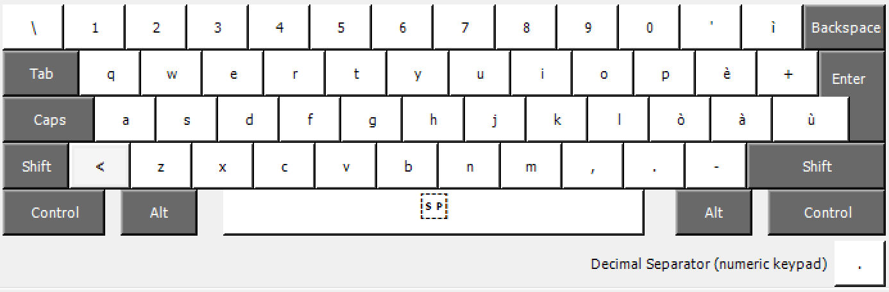
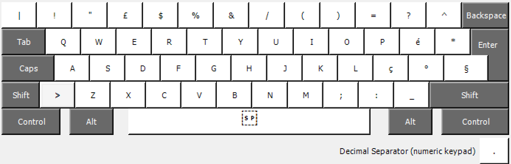
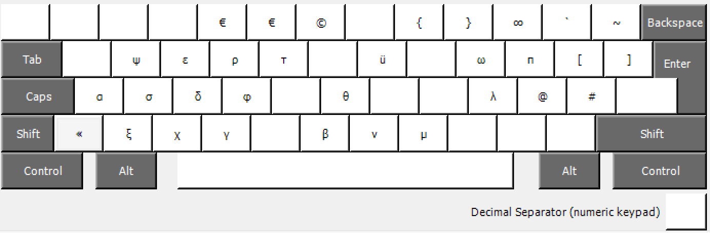
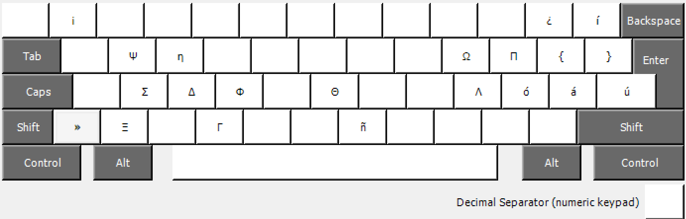

# Ita_PP Keyboard configuration, version 2.
Pietro Patelli 2019

## Layout
Normal:

When pressing `Shift`:

When pressing `AltGr` or `Ctrl + Alt`:

When pressing `Shift + AltGr` or `Shift + Ctrl + Alt`:

### This keyboard configuration modifies the standard Windows Italian keyboard in order to add:

- Tilde: ~ (AltGr+ì)
- Backtick:  \` (ALtGr+') 
- { and } as AltGr+( and AltGr+)
- « and » as AltGr+< and AltGr+>
- € (AltGr+4 or AltGr+5)
- ∞ (AltGr+0)
- ñ (AltGr+N)
- ó (AltGr+ò
- á (AltGr+Shift+à)
- ú (AltGr+Shift+ù)
- ü (AltGr+u)
- í (AltGr+Shift+ì)
- ¿ (AltGr+?, equivalent to AlrGr+Shift+')
- ¡ (AltGr+!, equivalent to AltGr+Shift+1)
- Most greek letters used in mathematical notation, such as:
	- α (AltGr+a)
	- ε (AltGr+e)
	- η (AltGr+E)
	- ξ (AltGr+z)
	- σ (AltGr+s)
	- Σ (AltGr+S)
